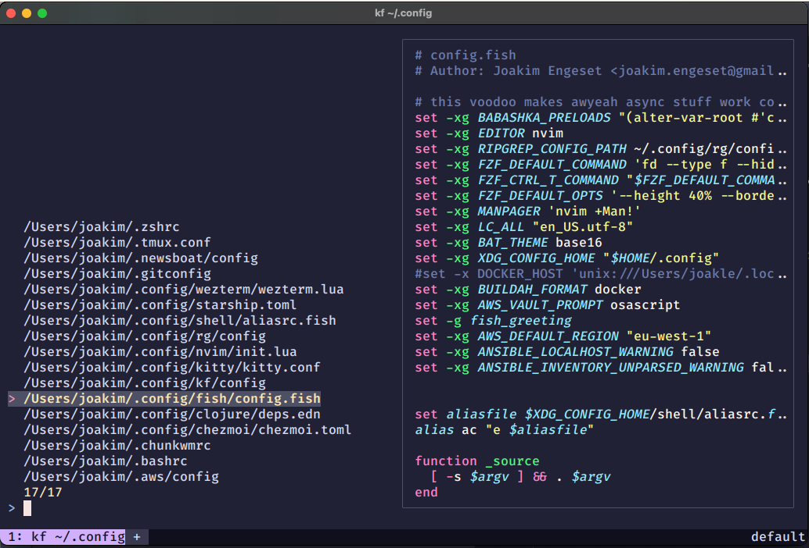

# kf

## Description

1. Reads your known files from a configuration file
   1. Filters out non-existing files and duplicates
2. Select file using fuzzy-matching and syntax-highlighted preview
3. Open selected file in `$EDITOR` or `nvim`

## Configuration

The configuration file `~/.config/kf/config` should contain a list of files you want to manage. Each line should contain a file path, such as `/Users/jason/.bashrc`, or `~/.zshrc`.